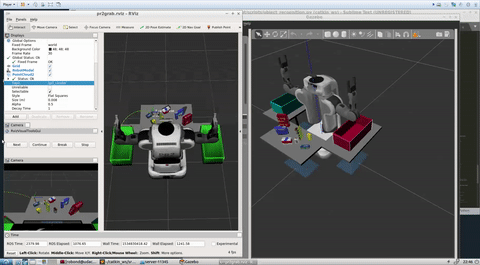
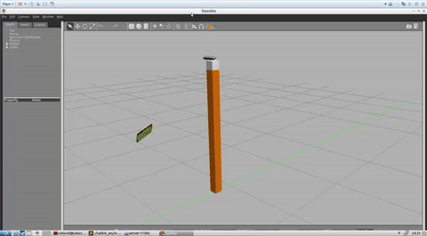

## Project: Perception Pick & Place

[//]: # (Image References)

[accuracy]: ./images/accuracy.png
[clustered-objects]: ./images/clustered-objects.jpg
[clusters]: ./images/clusters.jpg
[confusion]: ./images/confusion.jpg
[downsampled]: ./images/downsampled.jpg
[labeled1]: ./images/labeled1.jpg
[labeled2]: ./images/labeled2.jpg
[labeled]: ./images/labeled.jpg
[labeled-segmented]: ./images/labeled-segmented.jpg
[table]: ./images/table.jpg

![clustered-objects]
---

---

The main task in this project is to correctly recognize various objects on a table, locate them in 3D space, and output information needed for a robot to move the object to one of the bins.

### Environment
After setting up the provided simulation environment based on ROS, Rviz, and Gazebo, the first step is to subscribe to the point cloud message.    The depth channel from the RGB-D sensor is mapped to 3D world space, and each point retains it's color (RGB) information.

### Solution
To complete the task, we preprocess the data, cluster the points into objects, use an SVM model to classify each object point cloud as one of several objects, and provide the centroid of each recognized object to the pick and place server.

The main code for the solution is contained in `object_recognition.py`.

#### Preprocessing
To begin the task, we apply a simple noise filter to remove points which are not close to any cluster of other points.   We then filter out any points that fall outside of a rectangular 'work area'  using passthrough filters along the z  and x planes. The remaining points are then downsampled using a voxel-based downsampler.  The downsampled points will be the input into our object segmentation and recognition.

![downsampled]

#### Clustering and Segmentation
To obtain separate pointclouds for each object, we first identify the 'table' object using the RANSAC algorithm to find the plane of the table.  We remove the points recognized as part of the table, and the rest of the data is considered to belong to the objects to be recognized.  

![table]

To segment this remaining point cloud into objects, we apply a euclidean clustering using hyperparameters empiracally determined to result in pointclouds matching the objects to be recognized.  Primarily, we determine the min/max number of point in any object and a clustering radius threshold.  A centroid for each object is also caculated from the point cloud.  To visualize the clusters, we apply a different color to each segmented cluster (object).  

![clusters]
![clustered-objects]

#### Recognition
Recognition is performed using an SVM classifier which takes as input some engineered features based on color and normal histograms of an objects XYZRGB pointcloud.  The SVM outputs a class number corresponding to the predicted object.
For gathering the training set, we collect 50 RGBD samples of each object rotated at random angles.  

To obtain orientation-invariant features, in addition to capturing multiple angles, we compute three sets of histogram features and concatenate them.  The histograms are highly effective since the objects have brightly colored textures, distinctive textures as well as distincive shapes.  

1. 32 bin histogram of the R, G, and B color values
2. 32 bin histogram of H, S, and V color values
3. 32 bin histogram of X, Y, Z Normals

In total, there are 288 features (32 * 3 + 32 * 3  + 32 * 3) in each sample.   Each feature is normalized to be -1 to 1 so the XYZ and color features would have similar scale.

We trained a single model containing all the objects in worlds 1, 2, and 3, which were  8 objects total: 'sticky_notes', 'book', 'snacks', 'biscuits', 'eraser', 'soap2', 'soap', 'glue'.   Thus the training data set contained 400 samples (50 * 8) with 288 features and classifed 8 objects.

The resulting model is trained to convergance and achieves an accuracy of 85% on the validation set.
![accuracy]

We plot a matrix of confusion showing high confidence levels.  The errors evenly spread, hinting that the errors may be due to unfavorable rotations where the angle of the object causes little useful pointcloud data and thus a random guess by the classifier is as good as any.  

![confusion]

Interestingly, the confusion matrix shows a bright spot of misclassifying glue and soap2, which is also the only error in the final table recognition task.  The error however is mostly caused by the soap object occluding the glue object.  If the soap object were removed before the glue (misclassified as soap2), then subsequently the glue object would be recognized correctly for 100% accuracy.   
Once the objects are recognized, their centroid is calculated and they are compared to the pick list, and if they are in the pick list, a yaml-formatted message is output and message sent to a separate task which takes a centroid source and destination and handles grasping the object and moving it to the destination.

![labeled1]
![labeled2]
![labeled]

The task of building up the collusion map was left for a future effort, but even without it, the robot is able to collect several of the objects.

